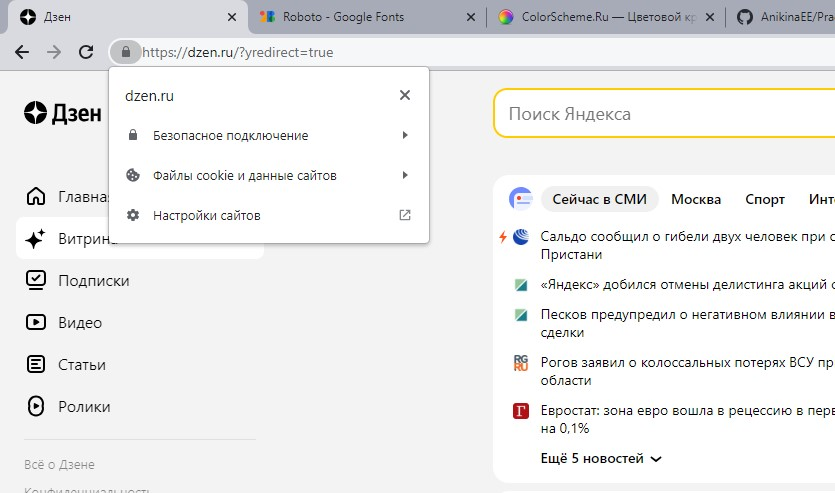
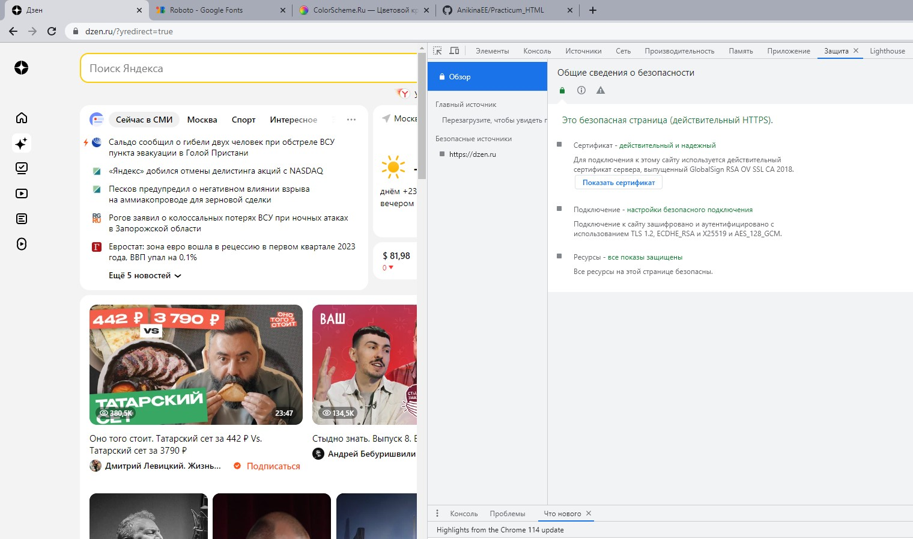
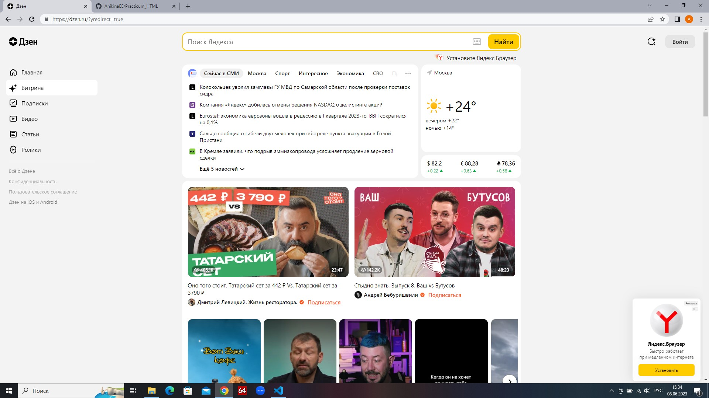
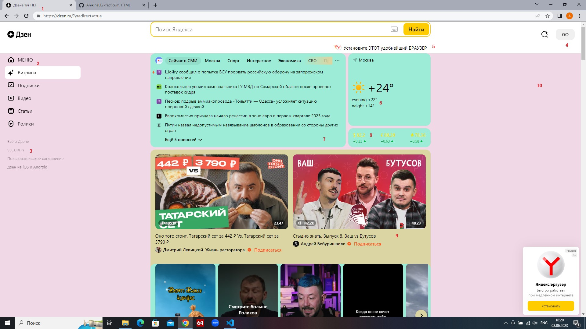
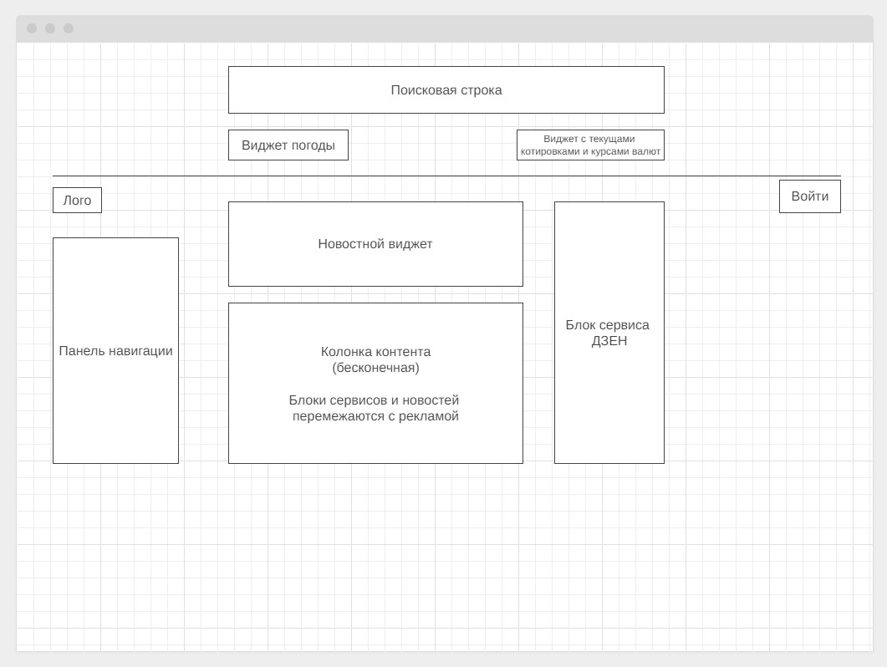

## **Задача**
На основе сайта [Яндекс](https://yandex.ru/ "Дзен")
1. ___Определить, на каком протоколе работает сайт___

Согласно ниже приведенным скриншотам сайт работает на защищенном протоколе HTTPS 

2. ___Проанализировать структуру страницы сайта___

Заголовок сайта (из видимого пользователю) отображает лишь название - "Дзен". Сам сайт состоит из одного "тела", внутри которого лежит:

* контент, который состоит из заголовков статей, самого текста, видео, картинок;
* новостной блок;
* боковое меню, содержащее различного рода подборки;
* поисковое окно;
* кнопка регистрации и входа в учетную запись;
* ссылки на погоду
* меню навигации по сайту

3. ___Внести не менее 10 изменений на страницу сайта с помощью инструмента разработчика и представить скриншоты ДО/ПОСЛЕ___

4. ___Создать прототип низкой детализации сайта___

