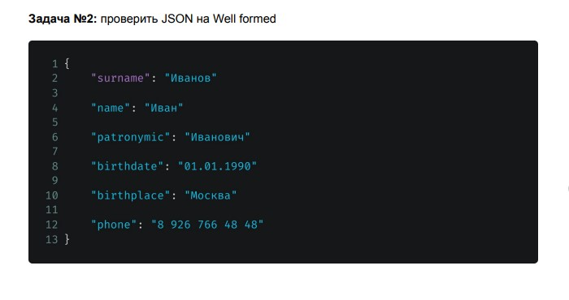

## Задача №2
Проверить JSON на Well formed 

Согласно правилам Well formed JSON:
1. Данные написаны в виде пар - "ключ: значение" - соблюдено
2. Данные разделены зяпятыми - НЕ соблюдено
3. Объект находится внутри фигурных скобок {} - соблюдено
4. Массив внутри квадратных скобок [] - в данном примере нет массива

*кавычки при указании телефона - лишние